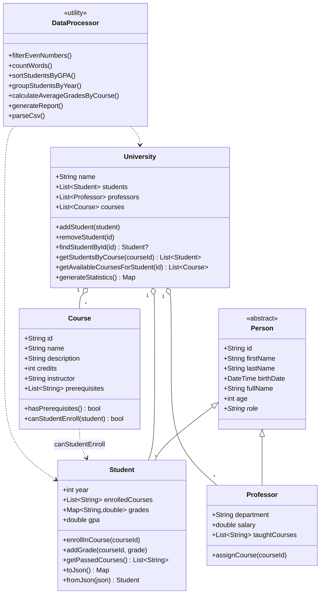

# UML-діаграма (Mermaid)

```mermaid
classDiagram
    class Person {
        <<abstract>>
        +String id
        +String firstName
        +String lastName
        +DateTime birthDate
        +String fullName
        +int age
        +String role*
    }
    class Student {
        +int year
        +List~String~ enrolledCourses
        +Map~String,double~ grades
        +double gpa
        +enrollInCourse(courseId)
        +addGrade(courseId, grade)
        +getPassedCourses() List~String~
        +toJson() Map
        +fromJson(json) Student
    }
    class Professor {
        +String department
        +double salary
        +List~String~ taughtCourses
        +assignCourse(courseId)
    }
    class Course {
        +String id
        +String name
        +String description
        +int credits
        +String instructor
        +List~String~ prerequisites
        +hasPrerequisites() bool
        +canStudentEnroll(student) bool
    }
    class University {
        +String name
        +List~Student~ students
        +List~Professor~ professors
        +List~Course~ courses
        +addStudent(student)
        +removeStudent(id)
        +findStudentById(id) Student?
        +getStudentsByCourse(courseId) List~Student~
        +getAvailableCoursesForStudent(id) List~Course~
        +generateStatistics() Map
    }
    class DataProcessor {
        <<utility>>
        +filterEvenNumbers()
        +countWords()
        +sortStudentsByGPA()
        +groupStudentsByYear()
        +calculateAverageGradesByCourse()
        +generateReport()
        +parseCsv()
    }
    Person <|-- Student
    Person <|-- Professor
    University "1" o-- "*" Student
    University "1" o-- "*" Professor
    University "1" o-- "*" Course
    Course ..> Student : canStudentEnroll
    DataProcessor ..> Student
    DataProcessor ..> University
```
